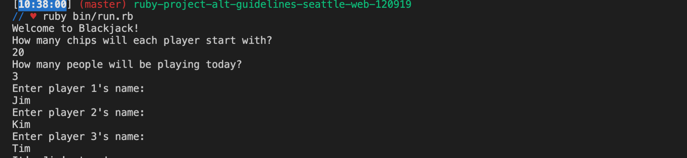
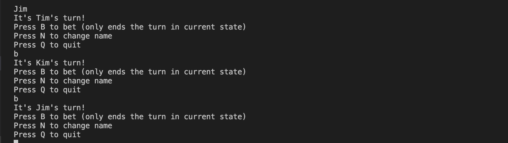
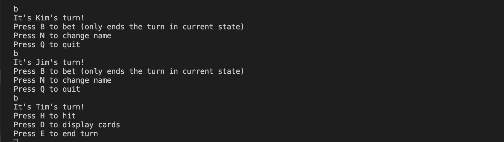
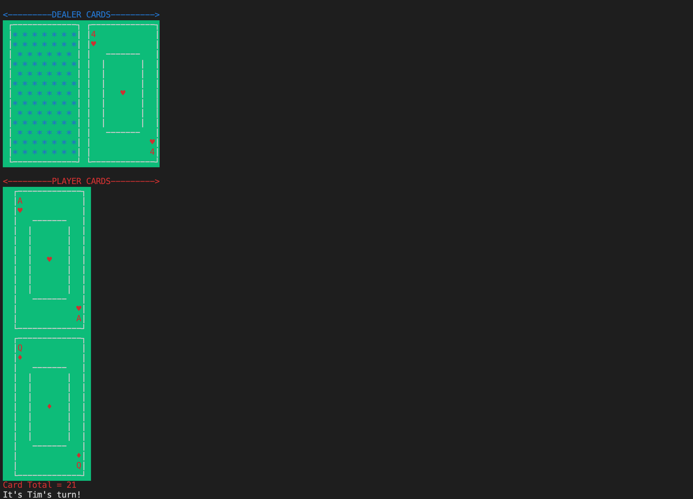
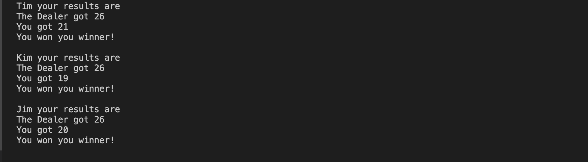
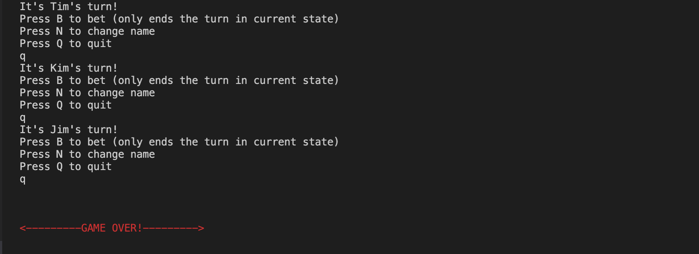

Blackjack
Flatiron School Project1
Created by Eric Stukenberg
Install link: https://github.com/EricStukenberg/ruby-project-alt-guidelines-seattle-web-120919
Video link: https://www.youtube.com/watch?v=VEMHgMXWVhk&feature=youtu.be

How to install
1. Go to install link provided above and fork and clone from there
  (how to fork and clone link: https://help.github.com/en/github/getting-started-with-github/fork-a-repo)

How to Run application
  Setup and how to run
  1. Migrate database with command:
    > rake db:migrate
  2. Seed database with command:
    > rake db:seed 
  3. Run program with command:
    > ruby bin/run.rb

How to use your application
1. Game setup
  * First, you will be asked how many chips you'd like each player to start with. Only positive  integers will work.
  * Secondly, you will be prompted for the number of players. Only positive integers will work, suggested less than 9.
  * Thirdly, you will have to enter each player's name.
  
2. Playing the game
  * Each player will be prompted with the pre-dealing menu (or bet menu). In current state bet will just end the pre-dealing round. You will be presented with 3 options and enter the associated letter.
  
    *Q will leave game
    *B will go to next player turn
    *N will prompt you to enter new name and change name.
  *Game menu, will give you prompts to hit, display card and end turn. This menu happens after cards are dealt.
    
    *Press D displays cards
    
    *Press H to hit. Which will add a card to your cards.
    *Press E to end turn which will end turn and it will be the next players turn or go to results.
  *Results is the final page of each round which tells you what you got and what the dealer got. 
  
3. End game 
  *If every player leaves the game will end.
  
